# Arash External API Service - Complete Architecture Documentation v1.1

This document provides a comprehensive overview of the Arash External API Service system architecture, including all modules, classes, functions, data flows, and integrations.

**Version**: 1.1.0
**API Version**: v1
**Last Updated**: 2025-10-29

## Table of Contents

1. [High-Level System Architecture](#high-level-system-architecture)
2. [Module Structure](#module-structure)
3. [Database Schema](#database-schema)
4. [API Endpoints](#api-endpoints)
5. [Request Flow](#request-flow)
6. [Authentication & Authorization](#authentication--authorization)
7. [Service Layer Details](#service-layer-details)

---

## High-Level System Architecture

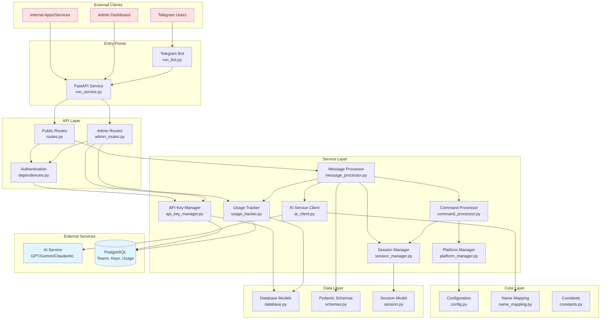
```mermaid
graph TB
    subgraph "External Clients"
        TG[Telegram Users]
        INT[Internal Apps/Services]
        ADMIN[Admin Dashboard]
    end

    subgraph "Entry Points"
        TGBOT[Telegram Bot<br/>run_bot.py]
        API[FastAPI Service<br/>run_service.py]
    end

    subgraph "API Layer"
        ROUTES[Public Routes<br/>routes.py]
        ADMIN_ROUTES[Admin Routes<br/>admin_routes.py]
        AUTH[Authentication<br/>dependencies.py]
    end

    subgraph "Service Layer"
        MSG_PROC[Message Processor<br/>message_processor.py]
        CMD_PROC[Command Processor<br/>command_processor.py]
        SESS_MGR[Session Manager<br/>session_manager.py]
        PLAT_MGR[Platform Manager<br/>platform_manager.py]
        AI_CLIENT[AI Service Client<br/>ai_client.py]
        API_KEY_MGR[API Key Manager<br/>api_key_manager.py]
        USAGE_TRACK[Usage Tracker<br/>usage_tracker.py]
    end

    subgraph "Core Layer"
        CONFIG[Configuration<br/>config.py]
        NAME_MAP[Name Mapping<br/>name_mapping.py]
        CONSTANTS[Constants<br/>constants.py]
    end

    subgraph "Data Layer"
        DB_MODELS[Database Models<br/>database.py]
        SCHEMAS[Pydantic Schemas<br/>schemas.py]
        SESSION_MODEL[Session Model<br/>session.py]
    end

    subgraph "External Services"
        AI_SERVICE[AI Service<br/>GPT/Gemini/Claude/etc.]
        POSTGRES[(PostgreSQL<br/>Teams, Keys, Usage)]
    end

    TG --> TGBOT
    INT --> API
    ADMIN --> API

    TGBOT --> API
    API --> ROUTES
    API --> ADMIN_ROUTES

    ROUTES --> AUTH
    ADMIN_ROUTES --> AUTH

    AUTH --> API_KEY_MGR

    ROUTES --> MSG_PROC
    ADMIN_ROUTES --> API_KEY_MGR
    ADMIN_ROUTES --> USAGE_TRACK

    MSG_PROC --> CMD_PROC
    MSG_PROC --> SESS_MGR
    MSG_PROC --> AI_CLIENT
    MSG_PROC --> USAGE_TRACK

    CMD_PROC --> SESS_MGR
    CMD_PROC --> PLAT_MGR

    SESS_MGR --> SESSION_MODEL
    PLAT_MGR --> CONFIG

    AI_CLIENT --> AI_SERVICE
    AI_CLIENT --> NAME_MAP

    API_KEY_MGR --> DB_MODELS
    API_KEY_MGR --> POSTGRES

    USAGE_TRACK --> DB_MODELS
    USAGE_TRACK --> POSTGRES

    MSG_PROC --> SCHEMAS

    style AI_SERVICE fill:#e1f5ff
    style POSTGRES fill:#e1f5ff
    style TG fill:#ffe1e1
    style INT fill:#ffe1e1
    style ADMIN fill:#ffe1e1
```

---

## Module Structure

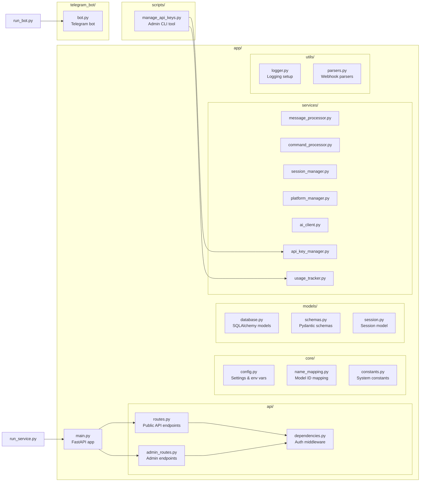
```mermaid
graph LR
    subgraph "app/"
        subgraph "api/"
            API_ROUTES[routes.py<br/>Public API endpoints]
            API_ADMIN[admin_routes.py<br/>Admin endpoints]
            API_DEPS[dependencies.py<br/>Auth middleware]
        end

        subgraph "core/"
            CORE_CONFIG[config.py<br/>Settings & env vars]
            CORE_NAME[name_mapping.py<br/>Model ID mapping]
            CORE_CONST[constants.py<br/>System constants]
        end

        subgraph "models/"
            MOD_DB[database.py<br/>SQLAlchemy models]
            MOD_SCHEMA[schemas.py<br/>Pydantic schemas]
            MOD_SESS[session.py<br/>Session model]
        end

        subgraph "services/"
            SRV_MSG[message_processor.py]
            SRV_CMD[command_processor.py]
            SRV_SESS[session_manager.py]
            SRV_PLAT[platform_manager.py]
            SRV_AI[ai_client.py]
            SRV_KEY[api_key_manager.py]
            SRV_USAGE[usage_tracker.py]
        end

        subgraph "utils/"
            UTIL_LOG[logger.py<br/>Logging setup]
            UTIL_PARSE[parsers.py<br/>Webhook parsers]
        end

        MAIN[main.py<br/>FastAPI app]
    end

    subgraph "scripts/"
        CLI[manage_api_keys.py<br/>Admin CLI tool]
    end

    subgraph "telegram_bot/"
        BOT[bot.py<br/>Telegram bot]
    end

    ROOT_API[run_service.py]
    ROOT_BOT[run_bot.py]

    ROOT_API --> MAIN
    ROOT_BOT --> BOT

    MAIN --> API_ROUTES
    MAIN --> API_ADMIN

    API_ROUTES --> API_DEPS
    API_ADMIN --> API_DEPS

    CLI --> SRV_KEY
    CLI --> SRV_USAGE
```

---

## Database Schema

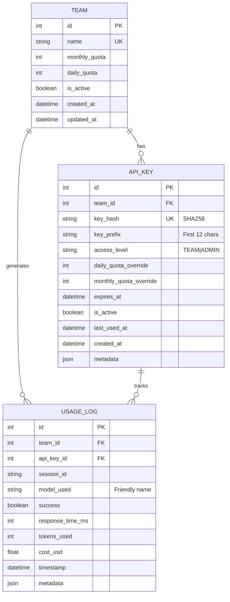
```mermaid
erDiagram
    TEAM ||--o{ API_KEY : has
    TEAM ||--o{ USAGE_LOG : generates
    API_KEY ||--o{ USAGE_LOG : tracks

    TEAM {
        int id PK
        string name UK
        int monthly_quota
        int daily_quota
        boolean is_active
        datetime created_at
        datetime updated_at
    }

    API_KEY {
        int id PK
        int team_id FK
        string key_hash UK "SHA256"
        string key_prefix "First 12 chars"
        string access_level "TEAM|ADMIN"
        int daily_quota_override
        int monthly_quota_override
        datetime expires_at
        boolean is_active
        datetime last_used_at
        datetime created_at
        json metadata
    }

    USAGE_LOG {
        int id PK
        int team_id FK
        int api_key_id FK
        string session_id
        string model_used "Friendly name"
        boolean success
        int response_time_ms
        int tokens_used
        float cost_usd
        datetime timestamp
        json metadata
    }
```

### Database Models Details

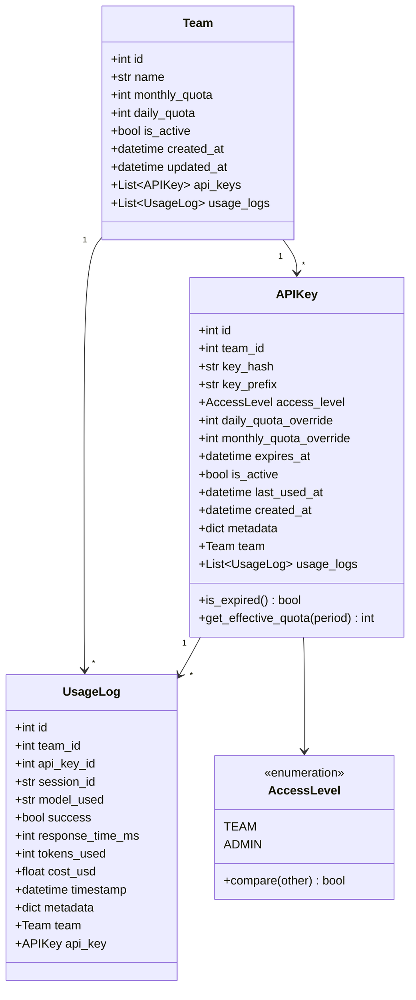
```mermaid
classDiagram
    class Team {
        +int id
        +str name
        +int monthly_quota
        +int daily_quota
        +bool is_active
        +datetime created_at
        +datetime updated_at
        +List~APIKey~ api_keys
        +List~UsageLog~ usage_logs
    }

    class APIKey {
        +int id
        +int team_id
        +str key_hash
        +str key_prefix
        +AccessLevel access_level
        +int daily_quota_override
        +int monthly_quota_override
        +datetime expires_at
        +bool is_active
        +datetime last_used_at
        +datetime created_at
        +dict metadata
        +Team team
        +List~UsageLog~ usage_logs
        +is_expired() bool
        +get_effective_quota(period) int
    }

    class UsageLog {
        +int id
        +int team_id
        +int api_key_id
        +str session_id
        +str model_used
        +bool success
        +int response_time_ms
        +int tokens_used
        +float cost_usd
        +datetime timestamp
        +dict metadata
        +Team team
        +APIKey api_key
    }

    class AccessLevel {
        <<enumeration>>
        TEAM
        ADMIN
        +compare(other) bool
    }

    Team "1" --> "*" APIKey
    Team "1" --> "*" UsageLog
    APIKey "1" --> "*" UsageLog
    APIKey --> AccessLevel
```

---

## API Endpoints (v1)

All API endpoints are prefixed with `/api/v1/` for versioning.

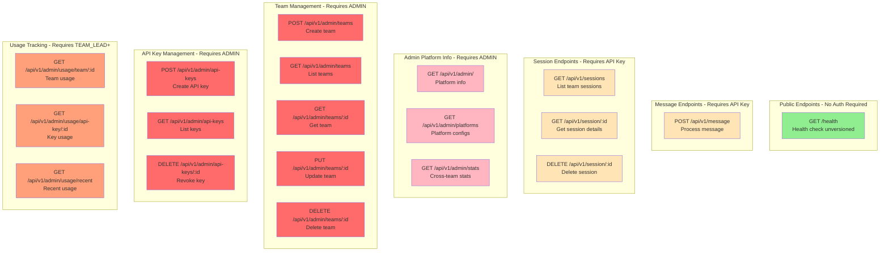
```mermaid
graph TB
    subgraph "Public Endpoints - No Auth Required"
        E1[GET /health<br/>Health check unversioned]
    end

    subgraph "Message Endpoints - Requires API Key"
        E5[POST /api/v1/message<br/>Process message]
    end

    subgraph "Session Endpoints - Requires API Key"
        E7[GET /api/v1/sessions<br/>List team sessions]
        E8[GET /api/v1/session/:id<br/>Get session details]
        E9[DELETE /api/v1/session/:id<br/>Delete session]
    end

    subgraph "Admin Platform Info - Requires ADMIN"
        E10[GET /api/v1/admin/<br/>Platform info]
        E11[GET /api/v1/admin/platforms<br/>Platform configs]
        E12[GET /api/v1/admin/stats<br/>Cross-team stats]
    end

    subgraph "Team Management - Requires ADMIN"
        E13[POST /api/v1/admin/teams<br/>Create team]
        E14[GET /api/v1/admin/teams<br/>List teams]
        E15[GET /api/v1/admin/teams/:id<br/>Get team]
        E16[PUT /api/v1/admin/teams/:id<br/>Update team]
        E17[DELETE /api/v1/admin/teams/:id<br/>Delete team]
    end

    subgraph "API Key Management - Requires ADMIN"
        E18[POST /api/v1/admin/api-keys<br/>Create API key]
        E19[GET /api/v1/admin/api-keys<br/>List keys]
        E20[DELETE /api/v1/admin/api-keys/:id<br/>Revoke key]
    end

    subgraph "Usage Tracking - Requires TEAM_LEAD+"
        E21[GET /api/v1/admin/usage/team/:id<br/>Team usage]
        E22[GET /api/v1/admin/usage/api-key/:id<br/>Key usage]
        E23[GET /api/v1/admin/usage/recent<br/>Recent usage]
    end

    style E1 fill:#90EE90
    style E5 fill:#FFE4B5
    style E7 fill:#FFE4B5
    style E8 fill:#FFE4B5
    style E9 fill:#FFE4B5
    style E10 fill:#FFB6C1
    style E11 fill:#FFB6C1
    style E12 fill:#FFB6C1
    style E13 fill:#FF6B6B
    style E14 fill:#FF6B6B
    style E15 fill:#FF6B6B
    style E16 fill:#FF6B6B
    style E17 fill:#FF6B6B
    style E18 fill:#FF6B6B
    style E19 fill:#FF6B6B
    style E20 fill:#FF6B6B
    style E21 fill:#FFA07A
    style E22 fill:#FFA07A
    style E23 fill:#FFA07A
```

**Key Changes in v1.1**:
- All endpoints at `/api/v1/` prefix
- Database-only API key authentication (no legacy)
- Team isolation enforced on all operations
- Platform info moved to admin-only endpoints
- Webhook handlers completely removed from codebase

---

## Request Flow

### Message Processing Flow

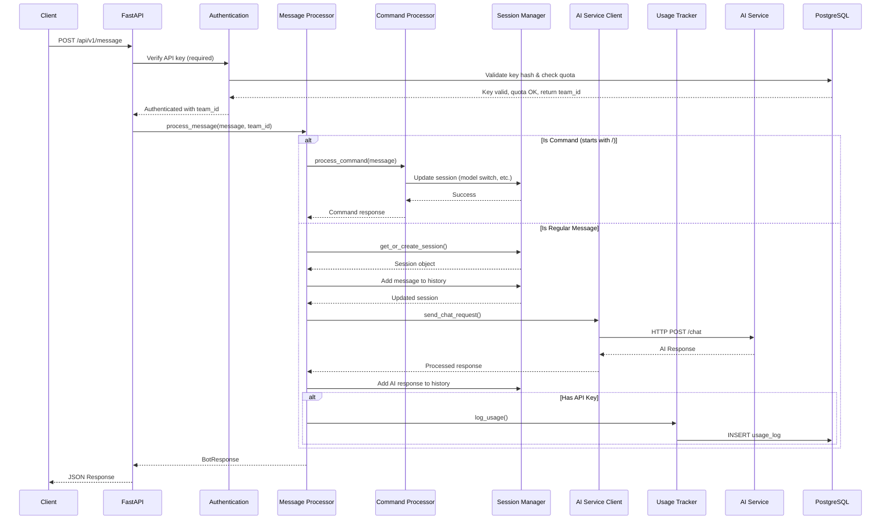
```mermaid
sequenceDiagram
    participant Client
    participant API as FastAPI
    participant Auth as Authentication
    participant MsgProc as Message Processor
    participant CmdProc as Command Processor
    participant SessMgr as Session Manager
    participant AIClient as AI Service Client
    participant UsageTrack as Usage Tracker
    participant AI as AI Service
    participant DB as PostgreSQL

    Client->>API: POST /api/v1/message
    API->>Auth: Verify API key (required)

    Auth->>DB: Validate key hash & check quota
    DB-->>Auth: Key valid, quota OK, return team_id
    Auth-->>API: Authenticated with team_id

    API->>MsgProc: process_message(message, team_id)

    alt Is Command (starts with /)
        MsgProc->>CmdProc: process_command(message)
        CmdProc->>SessMgr: Update session (model switch, etc.)
        SessMgr-->>CmdProc: Success
        CmdProc-->>MsgProc: Command response
    else Is Regular Message
        MsgProc->>SessMgr: get_or_create_session()
        SessMgr-->>MsgProc: Session object

        MsgProc->>SessMgr: Add message to history
        SessMgr-->>MsgProc: Updated session

        MsgProc->>AIClient: send_chat_request()
        AIClient->>AI: HTTP POST /chat
        AI-->>AIClient: AI Response

        AIClient-->>MsgProc: Processed response

        MsgProc->>SessMgr: Add AI response to history

        alt Has API Key
            MsgProc->>UsageTrack: log_usage()
            UsageTrack->>DB: INSERT usage_log
        end
    end

    MsgProc-->>API: BotResponse
    API-->>Client: JSON Response
```

### Admin API Key Creation Flow

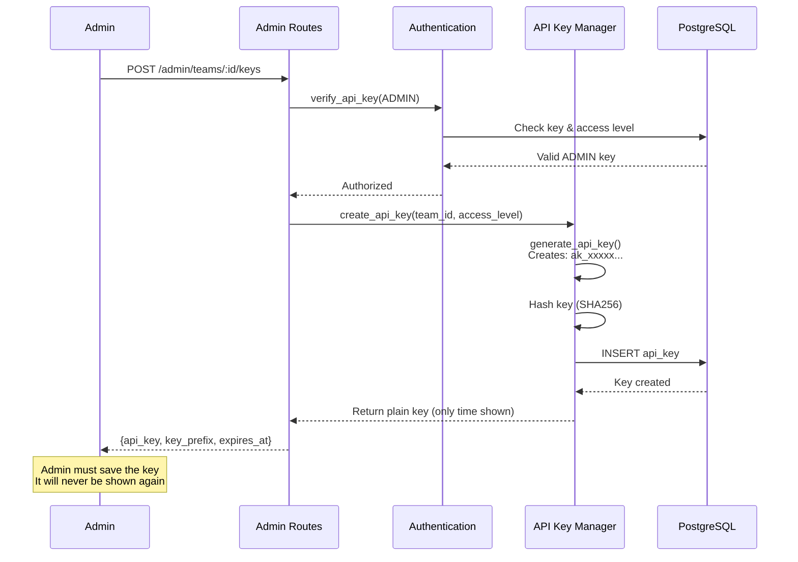
```mermaid
sequenceDiagram
    participant Admin
    participant API as Admin Routes
    participant Auth as Authentication
    participant KeyMgr as API Key Manager
    participant DB as PostgreSQL

    Admin->>API: POST /admin/teams/:id/keys
    API->>Auth: verify_api_key(ADMIN)
    Auth->>DB: Check key & access level
    DB-->>Auth: Valid ADMIN key
    Auth-->>API: Authorized

    API->>KeyMgr: create_api_key(team_id, access_level)
    KeyMgr->>KeyMgr: generate_api_key()<br/>Creates: ak_xxxxx...
    KeyMgr->>KeyMgr: Hash key (SHA256)
    KeyMgr->>DB: INSERT api_key
    DB-->>KeyMgr: Key created
    KeyMgr-->>API: Return plain key (only time shown)
    API-->>Admin: {api_key, key_prefix, expires_at}

    Note over Admin: Admin must save the key<br/>It will never be shown again
```

### Usage Tracking & Quota Check Flow

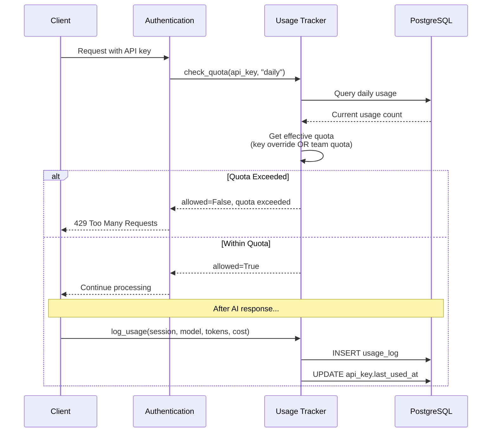
```mermaid
sequenceDiagram
    participant Client
    participant Auth as Authentication
    participant UsageTrack as Usage Tracker
    participant DB as PostgreSQL

    Client->>Auth: Request with API key
    Auth->>UsageTrack: check_quota(api_key, "daily")

    UsageTrack->>DB: Query daily usage
    DB-->>UsageTrack: Current usage count

    UsageTrack->>UsageTrack: Get effective quota<br/>(key override OR team quota)

    alt Quota Exceeded
        UsageTrack-->>Auth: allowed=False, quota exceeded
        Auth-->>Client: 429 Too Many Requests
    else Within Quota
        UsageTrack-->>Auth: allowed=True
        Auth-->>Client: Continue processing

        Note over Client,DB: After AI response...

        Client->>UsageTrack: log_usage(session, model, tokens, cost)
        UsageTrack->>DB: INSERT usage_log
        UsageTrack->>DB: UPDATE api_key.last_used_at
    end
```

---

## Authentication & Authorization

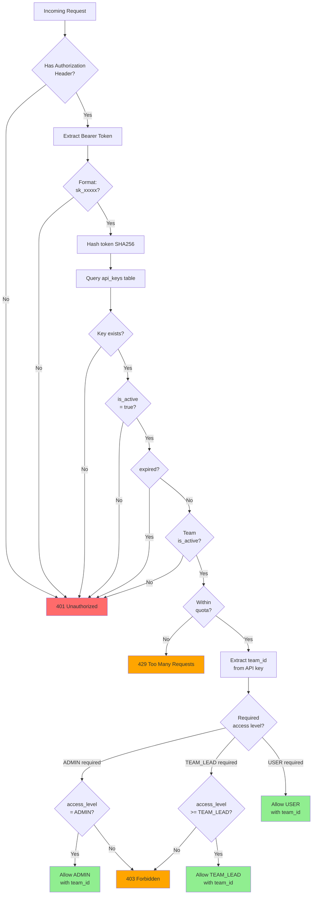
```mermaid
graph TD
    START[Incoming Request]

    START --> CHECK_HEADER{Has Authorization<br/>Header?}

    CHECK_HEADER -->|No| REJECT[401 Unauthorized]

    CHECK_HEADER -->|Yes| EXTRACT[Extract Bearer Token]
    EXTRACT --> CHECK_FORMAT{Format:<br/>sk_xxxxx?}

    CHECK_FORMAT -->|No| REJECT

    CHECK_FORMAT -->|Yes| HASH[Hash token SHA256]
    HASH --> DB_LOOKUP[Query api_keys table]

    DB_LOOKUP --> CHECK_EXISTS{Key exists?}
    CHECK_EXISTS -->|No| REJECT

    CHECK_EXISTS -->|Yes| CHECK_ACTIVE{is_active<br/>= true?}
    CHECK_ACTIVE -->|No| REJECT

    CHECK_ACTIVE -->|Yes| CHECK_EXPIRED{expired?}
    CHECK_EXPIRED -->|Yes| REJECT

    CHECK_EXPIRED -->|No| CHECK_TEAM{Team<br/>is_active?}
    CHECK_TEAM -->|No| REJECT

    CHECK_TEAM -->|Yes| CHECK_QUOTA{Within<br/>quota?}
    CHECK_QUOTA -->|No| REJECT_429[429 Too Many Requests]

    CHECK_QUOTA -->|Yes| EXTRACT_TEAM[Extract team_id<br/>from API key]
    EXTRACT_TEAM --> CHECK_ACCESS{Required<br/>access level?}

    CHECK_ACCESS -->|ADMIN required| IS_ADMIN{access_level<br/>= ADMIN?}
    IS_ADMIN -->|Yes| ALLOW_ADMIN[Allow ADMIN<br/>with team_id]
    IS_ADMIN -->|No| REJECT_403[403 Forbidden]

    CHECK_ACCESS -->|TEAM_LEAD required| IS_TEAM_LEAD{access_level<br/>>= TEAM_LEAD?}
    IS_TEAM_LEAD -->|Yes| ALLOW_LEAD[Allow TEAM_LEAD<br/>with team_id]
    IS_TEAM_LEAD -->|No| REJECT_403

    CHECK_ACCESS -->|USER required| ALLOW_USER[Allow USER<br/>with team_id]

    style ALLOW_ADMIN fill:#90EE90
    style ALLOW_LEAD fill:#90EE90
    style ALLOW_USER fill:#90EE90
    style REJECT fill:#FF6B6B
    style REJECT_429 fill:#FFA500
    style REJECT_403 fill:#FFA500
```

**Key Changes in v1.1**:
- **No legacy authentication** - Database API keys only
- **No anonymous access** - All endpoints require authentication
- **Team ID extraction** - Every authenticated request includes team_id
- **Simpler flow** - Removed INTERNAL_API_KEY and Telegram platform checks

### Access Level Hierarchy

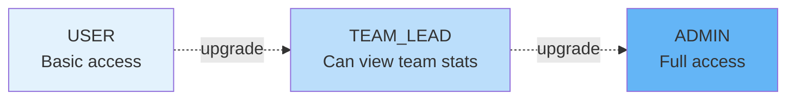
```mermaid
graph LR
    USER[USER<br/>Basic access]
    TEAM_LEAD[TEAM_LEAD<br/>Can view team stats]
    ADMIN[ADMIN<br/>Full access]

    USER -.upgrade.-> TEAM_LEAD
    TEAM_LEAD -.upgrade.-> ADMIN

    style USER fill:#E3F2FD
    style TEAM_LEAD fill:#BBDEFB
    style ADMIN fill:#64B5F6
```

---

## Service Layer Details

### Message Processor

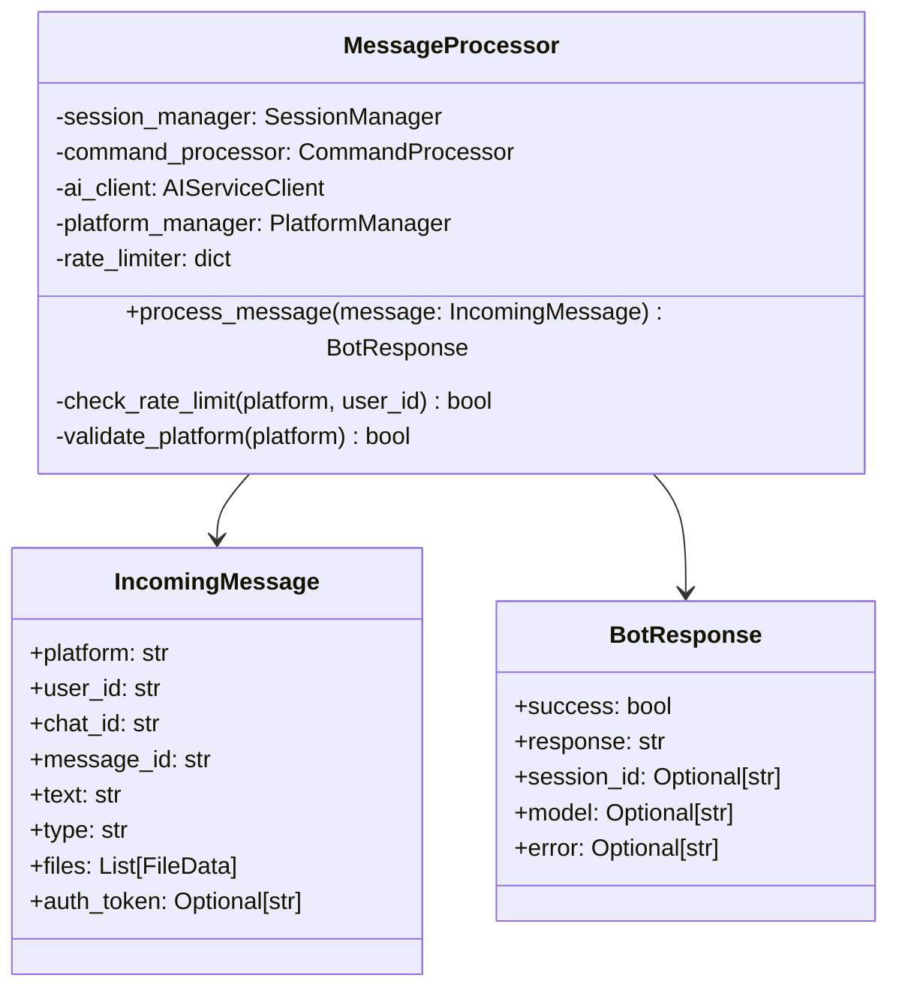
```mermaid
classDiagram
    class MessageProcessor {
        -session_manager: SessionManager
        -command_processor: CommandProcessor
        -ai_client: AIServiceClient
        -platform_manager: PlatformManager
        -rate_limiter: dict
        +process_message(message: IncomingMessage) BotResponse
        -check_rate_limit(platform, user_id) bool
        -validate_platform(platform) bool
    }

    class IncomingMessage {
        +platform: str
        +user_id: str
        +chat_id: str
        +message_id: str
        +text: str
        +type: str
        +files: List[FileData]
        +auth_token: Optional[str]
    }

    class BotResponse {
        +success: bool
        +response: str
        +session_id: Optional[str]
        +model: Optional[str]
        +error: Optional[str]
    }

    MessageProcessor --> IncomingMessage
    MessageProcessor --> BotResponse
```

### Session Manager

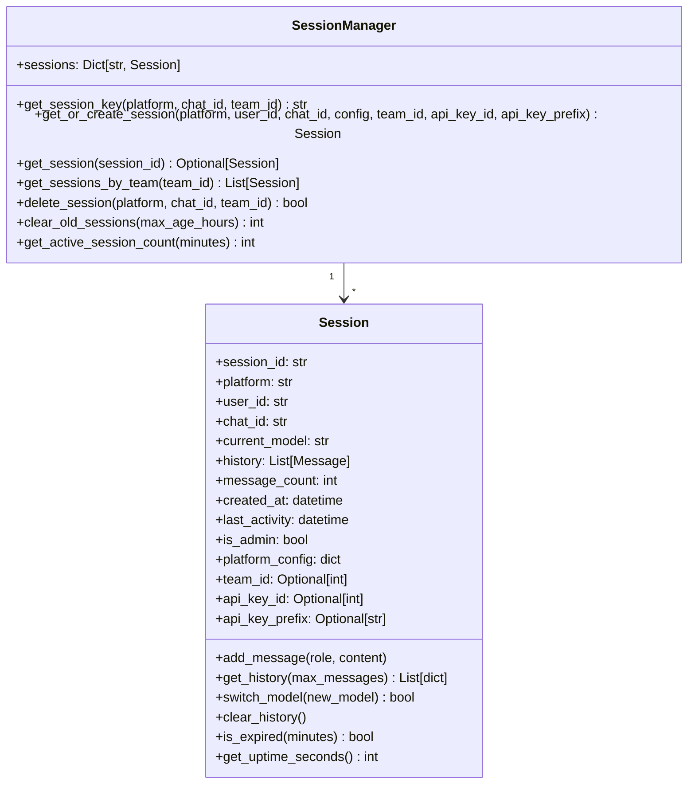
```mermaid
classDiagram
    class SessionManager {
        +sessions: Dict[str, Session]
        +get_session_key(platform, chat_id, team_id) str
        +get_or_create_session(platform, user_id, chat_id, config, team_id, api_key_id, api_key_prefix) Session
        +get_session(session_id) Optional[Session]
        +get_sessions_by_team(team_id) List[Session]
        +delete_session(platform, chat_id, team_id) bool
        +clear_old_sessions(max_age_hours) int
        +get_active_session_count(minutes) int
    }

    class Session {
        +session_id: str
        +platform: str
        +user_id: str
        +chat_id: str
        +current_model: str
        +history: List[Message]
        +message_count: int
        +created_at: datetime
        +last_activity: datetime
        +is_admin: bool
        +platform_config: dict
        +team_id: Optional[int]
        +api_key_id: Optional[int]
        +api_key_prefix: Optional[str]
        +add_message(role, content)
        +get_history(max_messages) List[dict]
        +switch_model(new_model) bool
        +clear_history()
        +is_expired(minutes) bool
        +get_uptime_seconds() int
    }

    SessionManager "1" --> "*" Session
```

### Command Processor

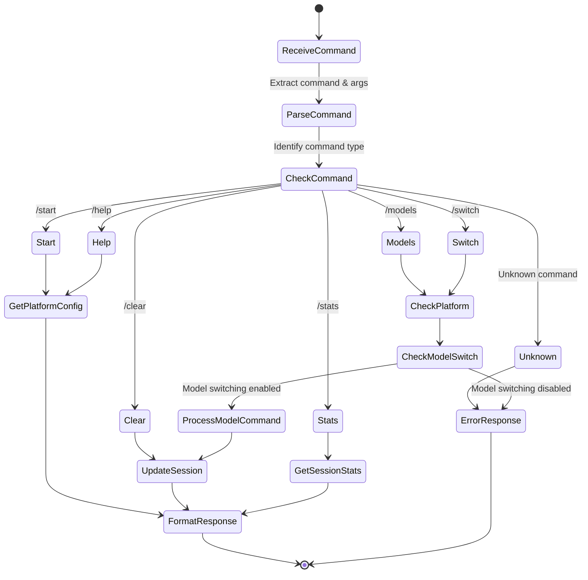
```mermaid
stateDiagram-v2
    [*] --> ReceiveCommand

    ReceiveCommand --> ParseCommand: Extract command & args

    ParseCommand --> CheckCommand: Identify command type

    CheckCommand --> Start: /start
    CheckCommand --> Help: /help
    CheckCommand --> Models: /models
    CheckCommand --> Switch: /switch
    CheckCommand --> Clear: /clear
    CheckCommand --> Stats: /stats
    CheckCommand --> Unknown: Unknown command

    Start --> GetPlatformConfig
    Help --> GetPlatformConfig
    Models --> CheckPlatform
    Switch --> CheckPlatform
    Clear --> UpdateSession
    Stats --> GetSessionStats
    Unknown --> ErrorResponse

    CheckPlatform --> CheckModelSwitch
    
    state CheckModelSwitch <<choice>>
    CheckModelSwitch --> ProcessModelCommand: Model switching enabled
    CheckModelSwitch --> ErrorResponse: Model switching disabled

    GetPlatformConfig --> FormatResponse
    ProcessModelCommand --> UpdateSession
    UpdateSession --> FormatResponse
    GetSessionStats --> FormatResponse

    FormatResponse --> [*]
    ErrorResponse --> [*]
```

### AI Service Client

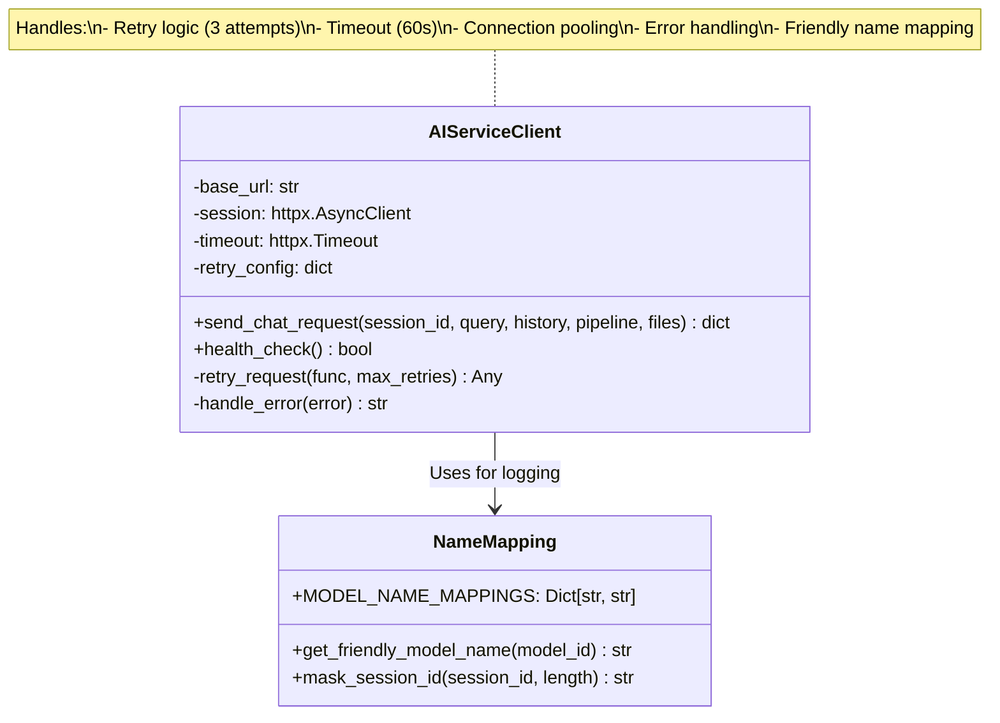
```mermaid
classDiagram
    class AIServiceClient {
        -base_url: str
        -session: httpx.AsyncClient
        -timeout: httpx.Timeout
        -retry_config: dict
        +send_chat_request(session_id, query, history, pipeline, files) dict
        +health_check() bool
        -retry_request(func, max_retries) Any
        -handle_error(error) str
    }

    class NameMapping {
        +MODEL_NAME_MAPPINGS: Dict[str, str]
        +get_friendly_model_name(model_id) str
        +mask_session_id(session_id, length) str
    }

    AIServiceClient --> NameMapping: Uses for logging

    note for AIServiceClient "Handles:\n- Retry logic (3 attempts)\n- Timeout (60s)\n- Connection pooling\n- Error handling\n- Friendly name mapping"
```

### API Key Manager

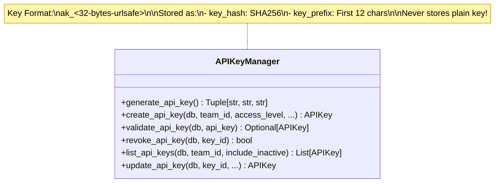
```mermaid
classDiagram
    class APIKeyManager {
        +generate_api_key() Tuple[str, str, str]
        +create_api_key(db, team_id, access_level, ...) APIKey
        +validate_api_key(db, api_key) Optional[APIKey]
        +revoke_api_key(db, key_id) bool
        +list_api_keys(db, team_id, include_inactive) List[APIKey]
        +update_api_key(db, key_id, ...) APIKey
    }

    note for APIKeyManager "Key Format:\nak_<32-bytes-urlsafe>\n\nStored as:\n- key_hash: SHA256\n- key_prefix: First 12 chars\n\nNever stores plain key!"
```

### Usage Tracker

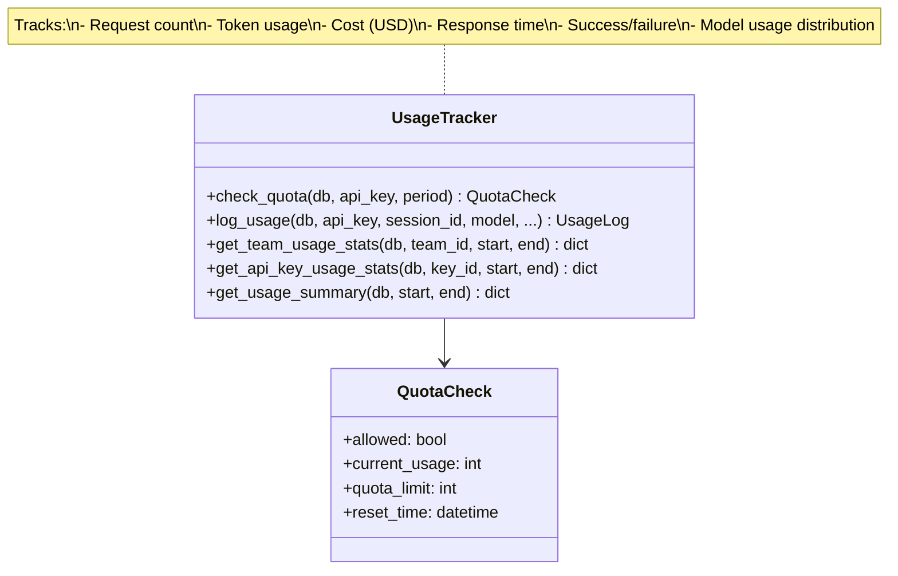
```mermaid
classDiagram
    class UsageTracker {
        +check_quota(db, api_key, period) QuotaCheck
        +log_usage(db, api_key, session_id, model, ...) UsageLog
        +get_team_usage_stats(db, team_id, start, end) dict
        +get_api_key_usage_stats(db, key_id, start, end) dict
        +get_usage_summary(db, start, end) dict
    }

    class QuotaCheck {
        +allowed: bool
        +current_usage: int
        +quota_limit: int
        +reset_time: datetime
    }

    UsageTracker --> QuotaCheck

    note for UsageTracker "Tracks:\n- Request count\n- Token usage\n- Cost (USD)\n- Response time\n- Success/failure\n- Model usage distribution"
```

### Platform Manager

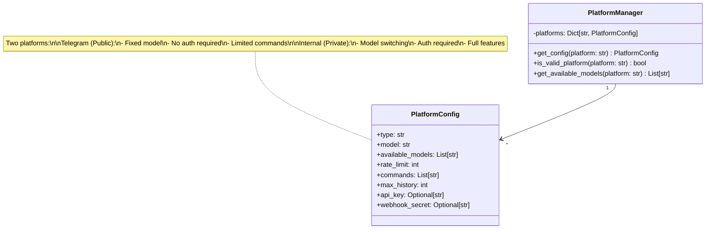
```mermaid
classDiagram
    class PlatformManager {
        -platforms: Dict[str, PlatformConfig]
        +get_config(platform: str) PlatformConfig
        +is_valid_platform(platform: str) bool
        +get_available_models(platform: str) List[str]
    }

    class PlatformConfig {
        +type: str
        +model: str
        +available_models: List[str]
        +rate_limit: int
        +commands: List[str]
        +max_history: int
        +api_key: Optional[str]
        +webhook_secret: Optional[str]
    }

    PlatformManager "1" --> "*" PlatformConfig

    note for PlatformConfig "Two platforms:\n\nTelegram (Public):\n- Fixed model\n- No auth required\n- Limited commands\n\nInternal (Private):\n- Model switching\n- Auth required\n- Full features"
```

---

## Complete Data Flow Example

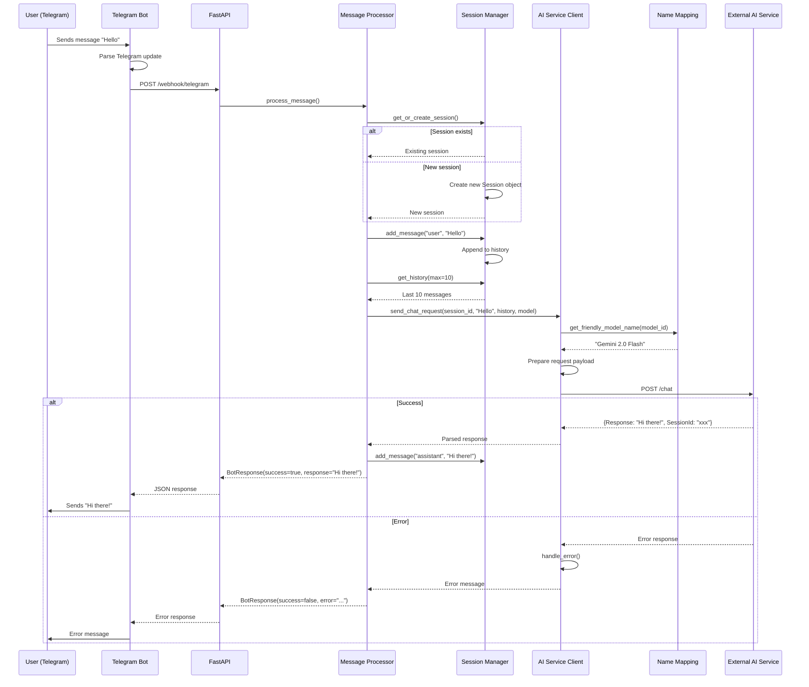
```mermaid
sequenceDiagram
    participant U as User (Telegram)
    participant TB as Telegram Bot
    participant API as FastAPI
    participant MP as Message Processor
    participant SM as Session Manager
    participant AI as AI Service Client
    participant NM as Name Mapping
    participant EXT as External AI Service

    U->>TB: Sends message "Hello"
    TB->>TB: Parse Telegram update
    TB->>API: POST /webhook/telegram

    API->>MP: process_message()

    MP->>SM: get_or_create_session()
    alt Session exists
        SM-->>MP: Existing session
    else New session
        SM->>SM: Create new Session object
        SM-->>MP: New session
    end

    MP->>SM: add_message("user", "Hello")
    SM->>SM: Append to history

    MP->>SM: get_history(max=10)
    SM-->>MP: Last 10 messages

    MP->>AI: send_chat_request(session_id, "Hello", history, model)

    AI->>NM: get_friendly_model_name(model_id)
    NM-->>AI: "Gemini 2.0 Flash"

    AI->>AI: Prepare request payload
    AI->>EXT: POST /chat

    alt Success
        EXT-->>AI: {Response: "Hi there!", SessionId: "xxx"}
        AI-->>MP: Parsed response

        MP->>SM: add_message("assistant", "Hi there!")

        MP-->>API: BotResponse(success=true, response="Hi there!")
        API-->>TB: JSON response
        TB->>U: Sends "Hi there!"

    else Error
        EXT-->>AI: Error response
        AI->>AI: handle_error()
        AI-->>MP: Error message
        MP-->>API: BotResponse(success=false, error="...")
        API-->>TB: Error response
        TB->>U: Error message
    end
```

---

## Model Name Mapping

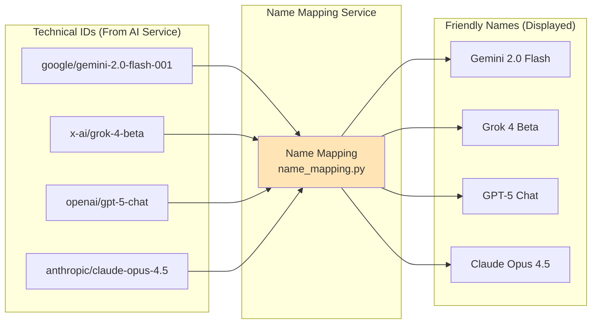
```mermaid
graph LR
    subgraph "Technical IDs (From AI Service)"
        T1["google/gemini-2.0-flash-001"]
        T2["x-ai/grok-4-beta"]
        T3["openai/gpt-5-chat"]
        T4["anthropic/claude-opus-4.5"]
    end

    subgraph "Name Mapping Service"
        NM[Name Mapping<br/>name_mapping.py]
    end

    subgraph "Friendly Names (Displayed)"
        F1["Gemini 2.0 Flash"]
        F2["Grok 4 Beta"]
        F3["GPT-5 Chat"]
        F4["Claude Opus 4.5"]
    end

    T1 --> NM --> F1
    T2 --> NM --> F2
    T3 --> NM --> F3
    T4 --> NM --> F4

    style NM fill:#FFE4B5
```

---

## Configuration & Environment

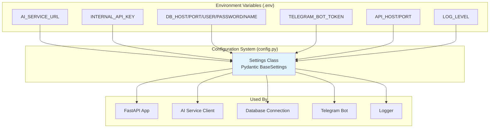
```mermaid
graph TB
    subgraph "Environment Variables (.env)"
        ENV1[AI_SERVICE_URL]
        ENV2[INTERNAL_API_KEY]
        ENV3[DB_HOST/PORT/USER/PASSWORD/NAME]
        ENV4[TELEGRAM_BOT_TOKEN]
        ENV5[API_HOST/PORT]
        ENV6[LOG_LEVEL]
    end

    subgraph "Configuration System (config.py)"
        CONFIG[Settings Class<br/>Pydantic BaseSettings]
    end

    subgraph "Used By"
        API[FastAPI App]
        AI_CLIENT[AI Service Client]
        DB[Database Connection]
        TG_BOT[Telegram Bot]
        LOGGER[Logger]
    end

    ENV1 --> CONFIG
    ENV2 --> CONFIG
    ENV3 --> CONFIG
    ENV4 --> CONFIG
    ENV5 --> CONFIG
    ENV6 --> CONFIG

    CONFIG --> API
    CONFIG --> AI_CLIENT
    CONFIG --> DB
    CONFIG --> TG_BOT
    CONFIG --> LOGGER

    style CONFIG fill:#E1F5FF
```

---

## Summary

This architecture provides:

1. **Multi-platform support**: Telegram (public) and Internal API (private)
2. **Enterprise features**: Team management, API key auth, usage tracking, quota enforcement
3. **Complete team isolation**: Session keys include team_id, all operations filtered by team
4. **Database-only authentication**: No legacy fallback, all API keys in PostgreSQL
5. **API versioning**: All endpoints at `/api/v1/` for future compatibility
6. **Confidentiality**: Service-agnostic naming, friendly model names, Telegram hidden from internal teams
7. **Scalability**: Connection pooling, session management, rate limiting
8. **Monitoring**: Usage analytics, health checks, statistics
9. **Security**: Multi-level access control (USER/TEAM_LEAD/ADMIN), SHA256 key hashing, quota limits
10. **Flexibility**: Model switching, platform-specific configs, extensible design

The system is designed to serve as a gateway to AI services while providing enterprise-level access control, monitoring, and management capabilities.

### Key Improvements in v1.1

- ✅ **Removed legacy authentication** - Simplified and more secure
- ✅ **Fixed session key collision** - Team ID included in session keys
- ✅ **Added team ownership checks** - Complete data isolation between teams
- ✅ **Added API versioning** - Ready for future v2 without breaking v1 clients
- ✅ **Strengthened security** - No bypass paths, mandatory team isolation
- ✅ **Removed webhook handlers** - Cleaner codebase, not needed
- ✅ **Fixed admin endpoint bugs** - Corrected indentation in usage endpoints
