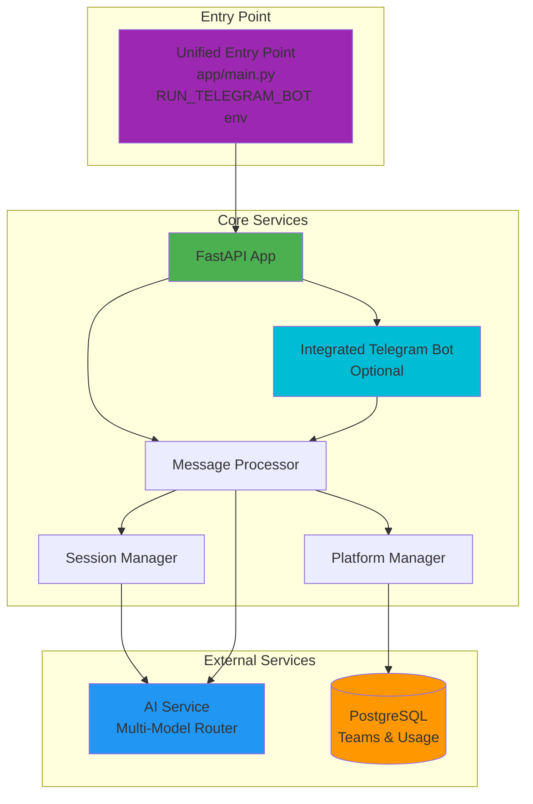
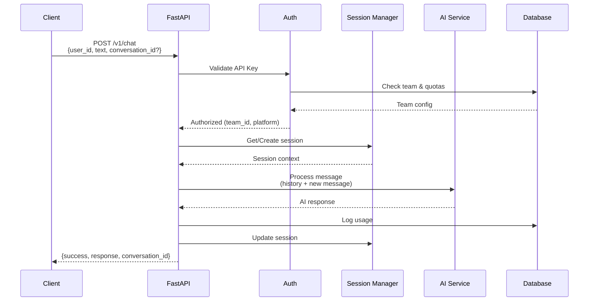

# Arash Bot

**Multi-platform AI chatbot service with team-based access control, supporting Telegram and REST API integrations.**

Powered by multiple AI models (GPT, Claude, Gemini, Grok, DeepSeek) with intelligent session management, rate limiting, and usage tracking.

---

## Architecture



## API Flow



---

## Quick Start

```bash
# 1. Install dependencies
poetry install

# 2. Configure environment
cp .env.example .env  # Edit: DB, AI_SERVICE_URL, tokens

# 3. Apply database migrations
make migrate-up

# 4. Run service (API + integrated Telegram bot)
make run
# API: http://localhost:3000
# Docs: http://localhost:3000/docs
```

---

## Configuration

Essential environment variables (`.env`):

```bash
# Database
DB_HOST=localhost
DB_PORT=5432
DB_USER=arash
DB_PASSWORD=***
DB_NAME=arash_db

# AI Service (external multi-model router)
AI_SERVICE_URL=https://your-ai-service.com

# Authentication
SUPER_ADMIN_API_KEYS=admin_key_1,admin_key_2  # Comma-separated
TELEGRAM_BOT_TOKEN=***
TELEGRAM_SERVICE_KEY=***  # For Telegram platform auth

# Runtime
RUN_TELEGRAM_BOT=true  # Run bot integrated with API service
ENVIRONMENT=production
LOG_LEVEL=INFO
```

---

## API Examples

### Chat Endpoint (Team Key)
```bash
curl -X POST http://localhost:3000/v1/chat \
  -H "Authorization: Bearer <team-api-key>" \
  -H "Content-Type: application/json" \
  -d '{
    "user_id": "user_123",
    "text": "سلام، چطوری؟"
  }'
```

**Response:**
```json
{
  "success": true,
  "response": "سلام! خوبم، ممنون. چطور می‌تونم کمکتون کنم؟",
  "conversation_id": "conv_abc123",
  "model": "Gemini 2.0 Flash",
  "message_count": 1
}
```

### Create Team (Admin Key)
```bash
curl -X POST http://localhost:3000/v1/admin/teams \
  -H "Authorization: Bearer <admin-api-key>" \
  -H "Content-Type: application/json" \
  -d '{
    "platform_name": "Internal-BI",
    "monthly_quota": 100000,
    "daily_quota": 5000
  }'
```

**Interactive Docs:** http://localhost:3000/docs

---

## Deployment

### Docker (Production)
```bash
docker build -t arash-bot .
docker run --env-file .env -p 3000:3000 arash-bot
```

### Kubernetes
Manifests available for dev/stage/prod environments:
```bash
kubectl apply -f manifests/prod/
```

---

## Development Commands

| Command | Description |
|---------|-------------|
| `make run` | Start service (port 3000) |
| `make run-dev` | Start with auto-reload |
| `make test` | Run test suite |
| `make lint` | Check code quality (ruff) |
| `make format` | Format code (black) |
| `make migrate-up` | Apply pending migrations |
| `make migrate-create MSG="..."` | Create new migration |
| `make docker-build` | Build Docker image |
| `make db-teams` | List all teams |
| `make db-keys` | List all API keys |

---

## Roadmap

Future enhancements planned for upcoming releases:

- 🎙️ **Voice Message Support** - Process audio messages via speech-to-text
- 🌐 **Multi-Language UI** - Internationalization for bot responses
- 📊 **Advanced Analytics Dashboard** - Real-time usage metrics and insights
- 🔔 **Team Usage Webhooks** - Real-time notifications for quota alerts
- 🧠 **Custom Model Fine-Tuning** - Team-specific AI model customization
- 👤 **Per-User Rate Limiting** - Granular rate control beyond team-level
- 📤 **Conversation Export API** - Export chat history in multiple formats
- 🔄 **Model Fallback Chain** - Automatic failover between AI models
- 🔐 **OAuth Integration** - Support for OAuth2 authentication flows

---

## License

MIT

---

**Version:** 1.1.0 | **Docs:** [OpenAPI Spec](http://localhost:3000/docs) | **Development:** See [CLAUDE.md](CLAUDE.md)
