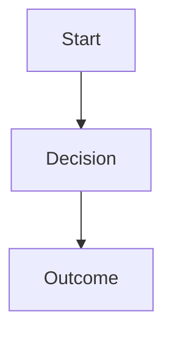

# ADR-000: [Short Title of Decision]

> **Template Version:** 1.0
> **Created:** YYYY-MM-DD
> **Last Updated:** YYYY-MM-DD
> **Status:** [Proposed | Accepted | Deprecated | Superseded]
> **Deciders:** [List of people involved]
> **Technical Story:** [Link to ticket/issue if applicable]

## Status

**Current Status:** [Proposed | Accepted | Deprecated | Superseded]

**Status History:**
- YYYY-MM-DD: [Status] - [Reason]

**Supersedes:** [ADR-XXX](./XXX-title.md) *(if applicable)*
**Superseded by:** [ADR-XXX](./XXX-title.md) *(if applicable)*
**Related to:** [ADR-XXX](./XXX-title.md), [ADR-YYY](./YYY-title.md) *(if applicable)*

---

## Context

### Problem Statement
<!-- What is the issue we're facing? What forces are at play? -->

### Business Drivers
<!-- What business needs or goals drive this decision? -->

### Technical Constraints
<!-- What technical limitations or requirements exist? -->

### Assumptions
<!-- What are we assuming to be true? -->

---

## Decision Drivers

<!-- What factors influenced this decision? List in priority order -->

1. **[Driver Name]** - [Description]
2. **[Driver Name]** - [Description]
3. **[Driver Name]** - [Description]

---

## Considered Options

### Option 1: [Name]
**Description:** [Detailed description]

**Pros:**
- ✅ [Benefit 1]
- ✅ [Benefit 2]

**Cons:**
- ❌ [Drawback 1]
- ❌ [Drawback 2]

**Cost/Effort:** [Low | Medium | High]

---

### Option 2: [Name]
**Description:** [Detailed description]

**Pros:**
- ✅ [Benefit 1]
- ✅ [Benefit 2]

**Cons:**
- ❌ [Drawback 1]
- ❌ [Drawback 2]

**Cost/Effort:** [Low | Medium | High]

---

### Option 3: [Name]
**Description:** [Detailed description]

**Pros:**
- ✅ [Benefit 1]
- ✅ [Benefit 2]

**Cons:**
- ❌ [Drawback 1]
- ❌ [Drawback 2]

**Cost/Effort:** [Low | Medium | High]

---

## Decision Outcome

### Chosen Option
**Selected:** Option [X] - [Name]

**Rationale:**
<!-- Why was this option chosen over others? -->

**Expected Outcomes:**
- [Outcome 1]
- [Outcome 2]

---

## Consequences

### Positive
- ✅ **[Benefit Category]:** [Description]
- ✅ **[Benefit Category]:** [Description]

### Negative
- ⚠️ **[Risk/Cost Category]:** [Description and mitigation plan]
- ⚠️ **[Risk/Cost Category]:** [Description and mitigation plan]

### Neutral
- 📋 **[Change Category]:** [Description]

### Technical Debt
- 💳 **[Debt Item]:** [Description and payback plan]

---

## Affected Components

### Direct Impact
<!-- Components that require changes -->

| Component | Type | Change Required | Effort | Risk |
|-----------|------|-----------------|--------|------|
| `path/to/component` | Code | [Description] | [S/M/L] | [L/M/H] |
| `path/to/config` | Config | [Description] | [S/M/L] | [L/M/H] |

### Indirect Impact
<!-- Components that may need adjustments -->

| Component | Type | Potential Impact | Monitoring Required |
|-----------|------|------------------|---------------------|
| `path/to/component` | Service | [Description] | Yes/No |

### Infrastructure Changes
- **Deployment:** [Changes needed]
- **Configuration:** [Changes needed]
- **Dependencies:** [Changes needed]
- **Environment Variables:** [Changes needed]

---

## Migration Path

### Phase 1: Preparation
**Timeline:** [Duration]

1. [Task 1]
2. [Task 2]

**Prerequisites:**
- [Prerequisite 1]
- [Prerequisite 2]

### Phase 2: Implementation
**Timeline:** [Duration]

1. [Task 1]
2. [Task 2]

**Rollback Plan:**
- [Step 1]
- [Step 2]

### Phase 3: Validation
**Timeline:** [Duration]

1. [Validation 1]
2. [Validation 2]

**Success Criteria:**
- [Criterion 1]
- [Criterion 2]

---

## Validation & Monitoring

### Success Metrics
| Metric | Target | Measurement Method |
|--------|--------|-------------------|
| [Metric 1] | [Target value] | [How to measure] |
| [Metric 2] | [Target value] | [How to measure] |

### Monitoring Plan
- **Health Checks:** [What to monitor]
- **Alerts:** [What triggers alerts]
- **Dashboards:** [What to track]

### Testing Strategy
- **Unit Tests:** [Coverage requirements]
- **Integration Tests:** [Scenarios to test]
- **Performance Tests:** [Load/stress tests]
- **Security Tests:** [Security validations]

---

## Compliance & Security

### Security Impact
- **Authentication/Authorization:** [Impact]
- **Data Privacy:** [Impact]
- **Encryption:** [Impact]
- **Audit Logging:** [Impact]

### Compliance Requirements
- **Standards:** [Which standards apply]
- **Regulations:** [Which regulations apply]
- **Audit Trail:** [What needs to be tracked]

---

## Documentation

### Required Updates
- [ ] API Documentation
- [ ] Architecture Diagrams
- [ ] Deployment Guides
- [ ] Runbooks
- [ ] Training Materials

### Knowledge Transfer
- **Team Training:** [What training is needed]
- **Documentation:** [What docs to create]

---

## Cost Analysis

### Development Cost
- **Time:** [Person-weeks]
- **Resources:** [What resources needed]

### Operational Cost
- **Infrastructure:** [Recurring costs]
- **Maintenance:** [Ongoing effort]
- **Support:** [Support requirements]

### ROI
- **Expected Benefits:** [Quantified benefits]
- **Payback Period:** [Estimated time]

---

## Risks & Mitigation

| Risk | Probability | Impact | Mitigation Strategy | Owner |
|------|-------------|--------|---------------------|-------|
| [Risk 1] | L/M/H | L/M/H | [Strategy] | [Name] |
| [Risk 2] | L/M/H | L/M/H | [Strategy] | [Name] |

---

## References

### Internal Resources
- [Link to design doc]
- [Link to technical spec]

### External Resources
- [Blog post or article]
- [Documentation]
- [Research paper]

### Related Decisions
- [ADR-XXX: Title](./XXX-title.md)

### Tools & Technologies
- [Tool/Tech 1](https://link) - [Description]
- [Tool/Tech 2](https://link) - [Description]

---

## Appendix

### Terminology
- **Term 1:** Definition
- **Term 2:** Definition

### Code Examples
```python
# Example implementation
```

### Diagrams


---

## Review & Approval

| Role | Name | Date | Signature/Approval |
|------|------|------|--------------------|
| Architect | [Name] | YYYY-MM-DD | ✅ |
| Tech Lead | [Name] | YYYY-MM-DD | ✅ |
| Security | [Name] | YYYY-MM-DD | ✅ |
| DevOps | [Name] | YYYY-MM-DD | ✅ |

---

## Change Log

| Date | Version | Author | Changes |
|------|---------|--------|---------|
| YYYY-MM-DD | 1.0 | [Name] | Initial version |
| YYYY-MM-DD | 1.1 | [Name] | [Changes made] |
