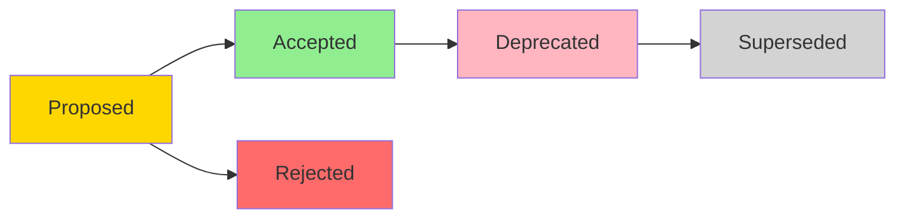

# Architecture Decision Records (ADR)

## Overview

This directory contains Architecture Decision Records (ADRs) for the Arash Bot project. ADRs document significant architectural and design decisions made throughout the project lifecycle.

## Purpose

ADRs help us:
- **Track** the evolution of our architecture over time
- **Understand** the context and reasoning behind past decisions
- **Communicate** architectural choices to current and future team members
- **Avoid** repeating past mistakes or revisiting settled debates
- **Ensure** consistency in architectural approach

## ADR Lifecycle



### Status Definitions

| Status | Description | Next Actions |
|--------|-------------|--------------|
| **Proposed** | Under discussion, not yet decided | Review, discuss, decide |
| **Accepted** | Approved and being implemented | Implement, monitor |
| **Deprecated** | No longer recommended, but still in use | Plan migration |
| **Superseded** | Replaced by a newer decision | Reference new ADR |
| **Rejected** | Considered but not chosen | Archive for reference |

## ADR Index

### Active Decisions

| ADR | Title | Status | Date | Impact |
|-----|-------|--------|------|--------|
| [001](./001-dependency-management-uv.md) | Migration from Poetry to uv | Accepted | 2025-01-14 | High |
| [002](./002-test-coverage-strategy.md) | Test Coverage Improvement Strategy | Accepted | 2025-01-14 | Medium |

### Deprecated/Superseded

| ADR | Title | Status | Superseded By | Date |
|-----|-------|--------|---------------|------|
| ~~003~~ | ~~Poetry Dependency Management~~ | Superseded | ADR-001 | 2024-XX-XX |

### Rejected

| ADR | Title | Status | Reason | Date |
|-----|-------|--------|--------|------|
| - | - | - | - | - |

## How to Use ADRs

### When to Create an ADR

Create an ADR when making decisions about:

- **Architecture:** Major structural changes (e.g., microservices vs monolith)
- **Technology:** Choosing frameworks, libraries, or platforms (e.g., Poetry vs uv)
- **Infrastructure:** Deployment, scaling, or hosting decisions
- **Data:** Database choices, data models, or storage strategies
- **Security:** Authentication, authorization, or encryption approaches
- **Integration:** External service integrations or API designs
- **Performance:** Caching strategies, optimization techniques
- **Development:** Build systems, testing strategies, or workflows

### When NOT to Create an ADR

Don't create ADRs for:
- Minor implementation details
- Bug fixes
- Code refactoring (unless it changes architecture)
- Routine dependency updates
- Configuration changes

### Creating a New ADR

1. **Copy the template:**
   ```bash
   cp docs/adr/000-adr-template.md docs/adr/00X-your-decision-title.md
   ```

2. **Number sequentially:**
   - Use the next available number (001, 002, 003, etc.)
   - Numbers are permanent, even for rejected ADRs

3. **Use descriptive titles:**
   - Good: `001-dependency-management-uv.md`
   - Bad: `001-update.md`

4. **Fill out all relevant sections:**
   - Context: Why is this needed?
   - Options: What alternatives did you consider?
   - Decision: What did you choose and why?
   - Consequences: What are the impacts?

5. **Get review:**
   - Share with team for feedback
   - Update based on discussions
   - Mark as "Accepted" once approved

6. **Update this index:**
   - Add entry to appropriate table
   - Link to the new ADR

### Updating an Existing ADR

**For minor updates:**
- Update the content directly
- Add entry to Change Log section
- Update "Last Updated" date

**For major changes:**
- Consider creating a new ADR that supersedes the old one
- Mark old ADR as "Superseded"
- Link between old and new ADRs

### Deprecating an ADR

When a decision is no longer recommended:

1. Change status to "Deprecated"
2. Add deprecation notice at the top
3. Explain why it's deprecated
4. Provide migration path
5. Update this index

### Superseding an ADR

When replacing an old decision with a new one:

1. Create new ADR with improved decision
2. Reference old ADR in "Supersedes" section
3. Mark old ADR as "Superseded by [new ADR]"
4. Update both index entries

## ADR Template

We use a comprehensive enterprise-grade template located at:
- [000-adr-template.md](./000-adr-template.md)

### Template Sections

Our template includes:
- **Status & Metadata:** Lifecycle tracking
- **Context:** Problem statement and drivers
- **Options:** Alternatives considered
- **Decision:** What was chosen and why
- **Consequences:** Positive, negative, and neutral impacts
- **Affected Components:** What needs to change
- **Migration Path:** How to implement
- **Validation:** Success metrics and monitoring
- **Compliance & Security:** Security and regulatory impacts
- **Documentation:** Required updates
- **Cost Analysis:** Development and operational costs
- **Risks:** Identified risks and mitigation
- **References:** Related resources

### Simplified Template

For simpler decisions, you can use a condensed version with:
- Status
- Context
- Decision
- Consequences
- Affected Components

## Best Practices

### Writing Style

✅ **Do:**
- Write in present tense for current state
- Use past tense for historical context
- Be specific and factual
- Include measurable criteria where possible
- Link to relevant resources
- Use diagrams where helpful

❌ **Don't:**
- Use vague language ("probably", "maybe")
- Make assumptions without stating them
- Skip the "why" behind decisions
- Forget to update status
- Leave sections blank without explanation

### Review Process

1. **Draft:** Author creates initial ADR
2. **Review:** Team reviews and provides feedback
3. **Discussion:** Address concerns and questions
4. **Approval:** Required approvers sign off
5. **Implementation:** Execute the decision
6. **Monitoring:** Track outcomes and metrics

### Tooling

We recommend:
- **Markdown:** For easy editing and version control
- **Git:** For tracking changes and history
- **Mermaid:** For diagrams (supported in most viewers)
- **Links:** Reference related ADRs and resources

## ADR Categories

We categorize ADRs by impact:

| Category | Examples | Review Level |
|----------|----------|--------------|
| **Critical** | Architecture changes, data models | Full team + stakeholders |
| **High** | Technology choices, security | Tech lead + senior engineers |
| **Medium** | Library selection, patterns | Tech lead review |
| **Low** | Tool choices, conventions | Peer review |

## References

### Standards & Frameworks
- [Michael Nygard's ADR](https://cognitect.com/blog/2011/11/15/documenting-architecture-decisions)
- [ADR GitHub Organization](https://adr.github.io/)
- [Thoughtworks Technology Radar](https://www.thoughtworks.com/radar)

### Related Documentation
- [CLAUDE.md](../../CLAUDE.md) - Development guide
- [README.md](../../README.md) - Project overview
- [Architecture Diagrams](../architecture/) *(if exists)*

## Questions?

If you have questions about:
- **Process:** Contact the tech lead
- **Specific ADR:** See the "Deciders" section in the ADR
- **Template:** Review [000-adr-template.md](./000-adr-template.md)

---

**Last Updated:** 2025-01-14
**Maintained by:** Arash Bot Team
**Template Version:** 1.0
